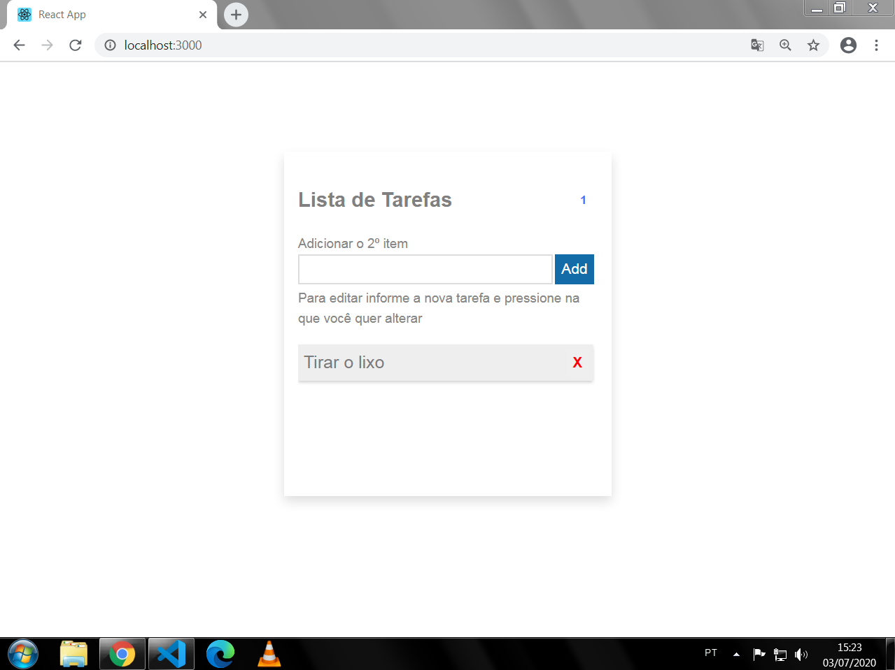

## Lista de tarefas
#### Lista de tarefas criada em ReactJS com opções de adicionar, atualizar e excluir um item da lista

## Tecnologias utilizadas

- ReactJS
- HTML5 e CSS3
- NPM

## Começando

Para explorar o projeto na sua máquina primeiro certifique-se que você tem o Git e o Node.JS instalado.

1º- Com o git pré-instalado clone o projeto:

~~~shell
git clone https://github.com/DaniloLima122/lista-de-tarefas-reactjs.git
~~~

2º - Navegue até o diretório da pasta que você clocou no passo anterior.

3º - Instale as dependências do projeto digitando o seguinte:
~~~shell
npm install
~~~

4º - Abra a pasta que você clonou no seu editor de preferência:

5º - Agora é só abrir o projeto no seu navegador digitando no seu terminal:
~~~shell
npm start
~~~

## Cntribuições

Fique a vontade para avaliar dando uma "star" ou contribuir com o projeto e reportar sobre bugs e dar sugestões de melhorias.

## Links

- Instalação do [Git](https://git-scm.com/)
- Instalação do [Node.js](https://nodejs.org/en/download/) 

## Licença
- [MIT](LICENSE.md)

